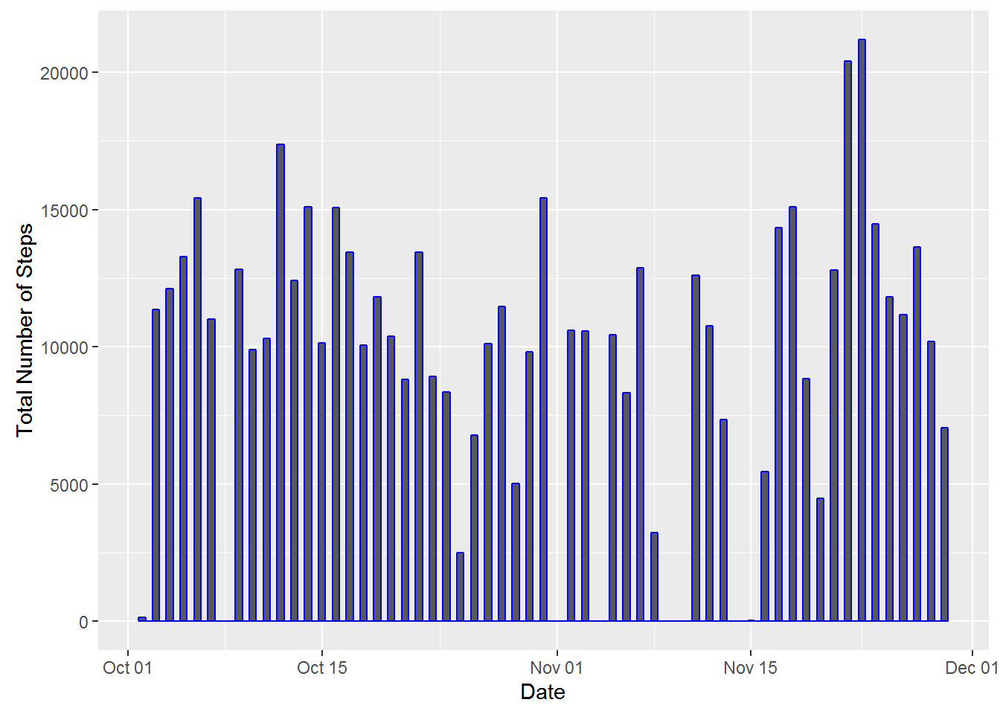
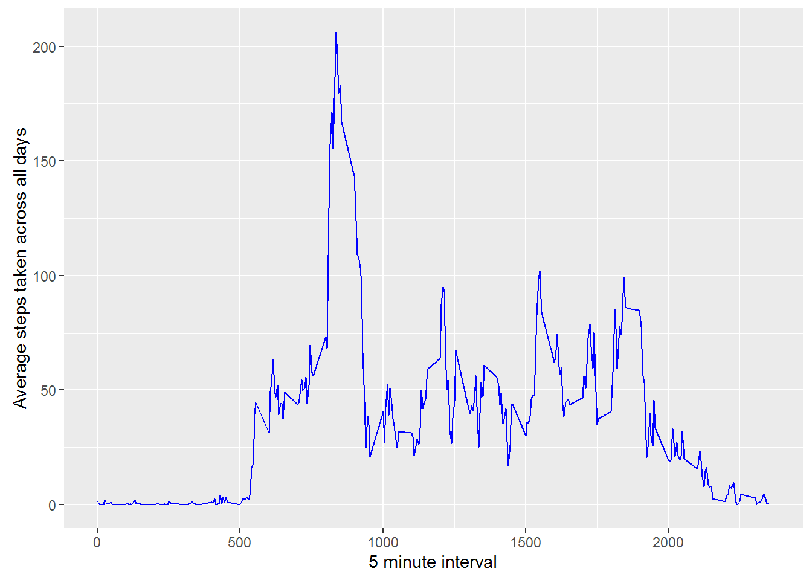
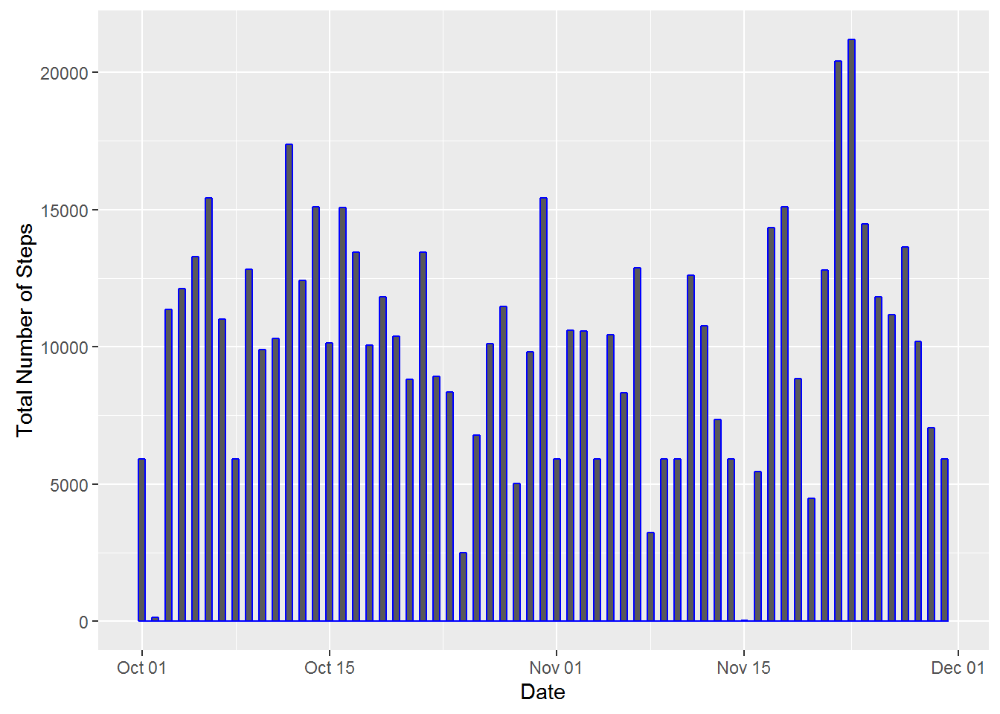
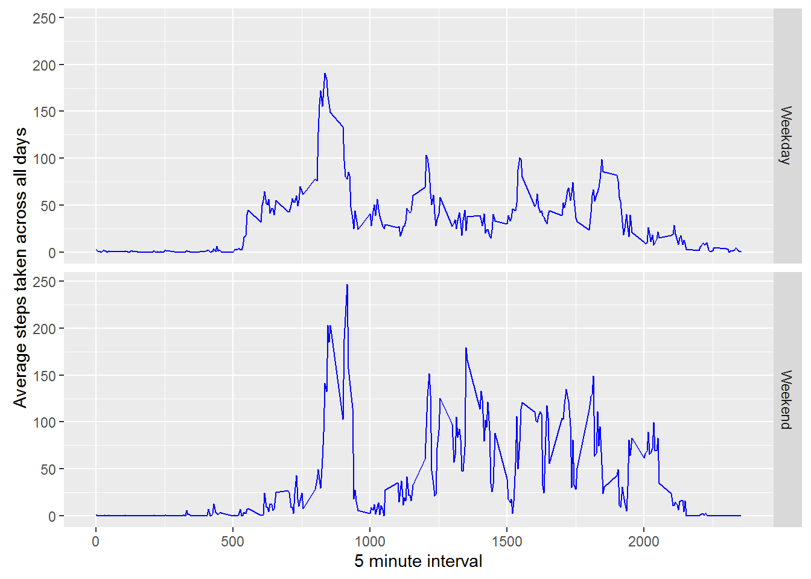

## Introduction

This assignment makes use of data from a personal activity monitoring device. This device collects data at 5 minute intervals through out the day. The data consists of two months of data from an anonymous individual collected during the months of October and November, 2012 and include the number of steps taken in 5 minute intervals each day.

he data for this assignment can be downloaded from the course web site:

Dataset: [Activity monitoring data](https://d396qusza40orc.cloudfront.net/repdata%2Fdata%2Factivity.zip) [52K]

- steps: Number of steps taking in a 5-minute interval (missing values are coded as NA)
- date: The date on which the measurement was taken in YYYY-MM-DD format
- interval: Identifier for the 5-minute interval in which measurement was taken

The dataset is stored in a comma-separated-value (CSV) file and there are a total of 17,568 observations in this dataset

### loading the dataset

```r
# load dplyr package
library(dplyr)

# load ggplot2 package
library(ggplot2)

# read the data from csv file in workspace
df <- read.csv("./activity.csv",stringsAsFactors = FALSE)

# Convert date colume to data type date
df <- mutate(df,date=as.Date(df$date))

## take subset of initial dataset by removing NA values
df1 <- subset(df,!is.na(df$steps)==TRUE)
```

### Calculating the total number of steps taken per day

```r
## Group by each day
## Calculate the sum of steps taken each day ignoring NA values
df1 <- group_by(df1,date)%>%
       summarise(step_sum=sum(steps,na.rm=TRUE))
```

### Creating Histogram of total number of steps taken each day

```r
p<-ggplot(data=df1,aes(date))
p+geom_histogram(aes(weight=step_sum),binwidth = 0.5,col="blue")+xlab("Date")+ylab("Total Number of Steps")
```



### The Mean and Median steps taken per day

```r
## Calculate the mean steps
mean(df1$step_sum,na.rm = TRUE)
```

```
## [1] 10766.19
```

```r
## Median Steps
median(df1$step_sum,na.rm = TRUE)
```

```
## [1] 10765
```


### Average daily activity pattern

```r
## create new dataframe for df excluding NA values
df2 <- subset(df,!is.na(df$steps)==TRUE)

## group based on interval
## take the mean over days for the interval groups
df2 <- group_by(df2,interval)%>%
       summarise(steps_mean= mean(steps))

## Draw time series plot fove average steps pver interval
p <- ggplot(data=df2,aes(x=interval,y=steps_mean))
p+geom_line(col="blue")+xlab("5 minute interval")+ylab("Average steps taken across all days")
```



```r
## Find the interval with maximum number of steps
xt <- filter(df2,steps_mean==max(df2$steps_mean))

## dispaly as table
kable(xt)
```


 interval   steps_mean
---------  -----------
      835     206.1698

### The 5 min interval which contains maximum number of steps is 835

## Imputing missing values:
### We will impute the missing values by using the KNN: K nearest neighbour algorithm, for this we would have to install the impute package.

### Impute package can be installed by running the following commands:
source("https://bioconductor.org/biocLite.R")

biocLite("impute")


```r
## Calculate total number of missing NA values
sum(is.na(df$steps))
```
### Total number of missing values are: 2304


```r
## load impute package
library(impute)

## To run the impute knn method we would have to first convert the input into matrix form
## remove the date column as it is not required
mm<- as.matrix(df[,-2])

## run the knn impute function
## the result will be returned as list data type
mm <- impute.knn(mm)

## Convert the data elemement of list mm into data frame
dfImputed <- as.data.frame(mm$data)

## Change the names of the columns as steps_imputed and interval
names(dfImputed) <- c("steps_imputed","interval_imputed")

## Column bind the imputed data frame and the original data frame
dfImputed <- cbind(df,dfImputed)

## remove steps and interval from dfImputed data frame
## We get dataframe with imputed values- data set with missing values filled in
dfImputed <- dfImputed[,c(-1,-3)]
```

### Histogram on the dataset with missing values filled in based on KNN

```r
## group by date
## find the sum of the steps
df3 <- group_by(dfImputed,date)%>%
             summarise(step_sum=sum(steps_imputed))

## draw histograme on the imputed dataframe
p<-ggplot(data=df3,aes(date))
p+geom_histogram(aes(weight=step_sum),binwidth = 0.5,col="blue")+xlab("Date")+ylab("Total Number of Steps")
```



```r
# mean on the original dataset
mean(df1$step_sum,na.rm = TRUE)
```

```
## [1] 10766.19
```

```r
# mean on the imputed dataset
mean(df3$step_sum)
```

```
## [1] 10131.02
```

```r
# median on the original dataset 
median(df1$step_sum,na.rm = TRUE)
```

```
## [1] 10765
```

```r
# median on the Imputed dataset 
median(df3$step_sum)
```

```
## [1] 10395
```

### As can be seen from the above values both the mean and median values of imputed data set have decreased slightly

## Difference in activity pattern between Weekdays and Weekend:


```r
## create new data frame from dfimputed containing IsWeekDay column
df4 <- mutate(dfImputed,IsWeekDay= weekdays(date))

## Loop through the new dataframe and set the day as either weekend or weekday
## based on if the day is starurday,sunday or other day
for(i in 1:length(df4[,"IsWeekDay"]))
{
  if(df4[i,"IsWeekDay"]=="Sunday")
  {
    df4[i,"IsWeekDay"]="Weekend"
  }
  if(df4[i,"IsWeekDay"]=="Saturday")
  {
    df4[i,"IsWeekDay"]="Weekend"
  }
  else
  {
    df4[i,"IsWeekDay"]="Weekday"
  }
}

## Convert IsWeekDay column into factor variable
## This creates new dataframe with factor variable for weekend and weekday
df4 <- mutate(df4,IsWeekDay= as.factor(IsWeekDay))

## group by based on interval and IsWeekDay
## take mean of steps over days
df4 <- group_by(df4,interval_imputed,IsWeekDay)%>%
       summarise(step_mean=mean(steps_imputed))

## make time series plot based on weeken or weekday
p <- ggplot(data=df4,aes(x=interval_imputed,y=step_mean))
p+geom_line(col="blue")+facet_grid(IsWeekDay~.)+xlab("5 minute interval")+ylab("Average steps taken across all days")
```




